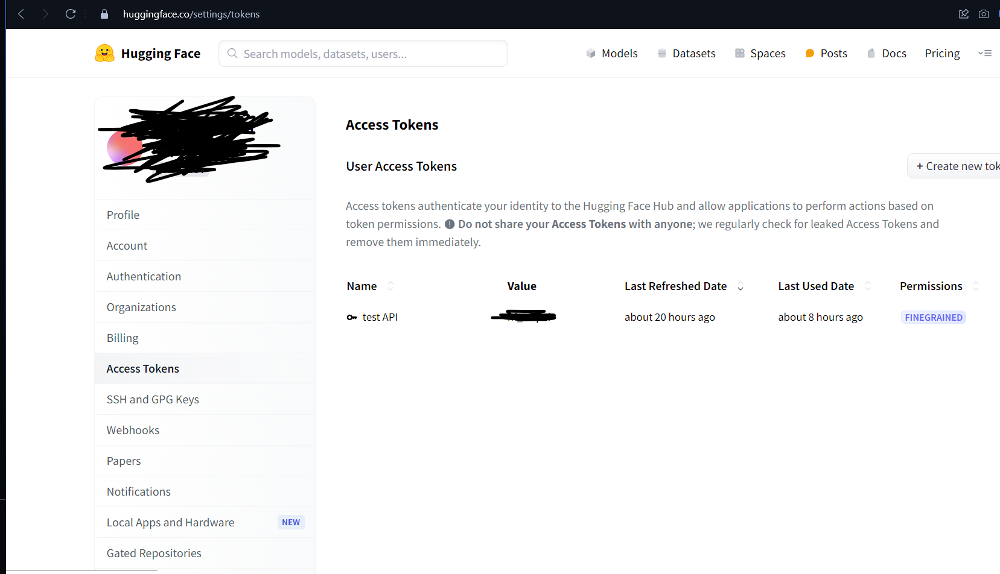

## Clone this repository
 https://github.com/Ronald2329/IAForIA if not installed git, install: https://git-scm.com/downloads
## Access API HuggingFace (if you created account else create now!), create a new token:More details: <iframe src="https://www.youtube.com/watch?v=n28awivN2FA">
## Create .env file
add row: HUGGINGFACE_API_KEY = YOUR_PRIVATE_KEY
add row: GEMINI_API_KEY = YOUR_PRIVATE_KEY
## OBS:
installing better-sqlite3:^9.4.3 because my node version is: v20.12.2
## Install dependecies
npm install 
## Run command else your crying weeks hahaha
npx electron-rebuild
## Generate image
node CLI.js
## Run project
npm start